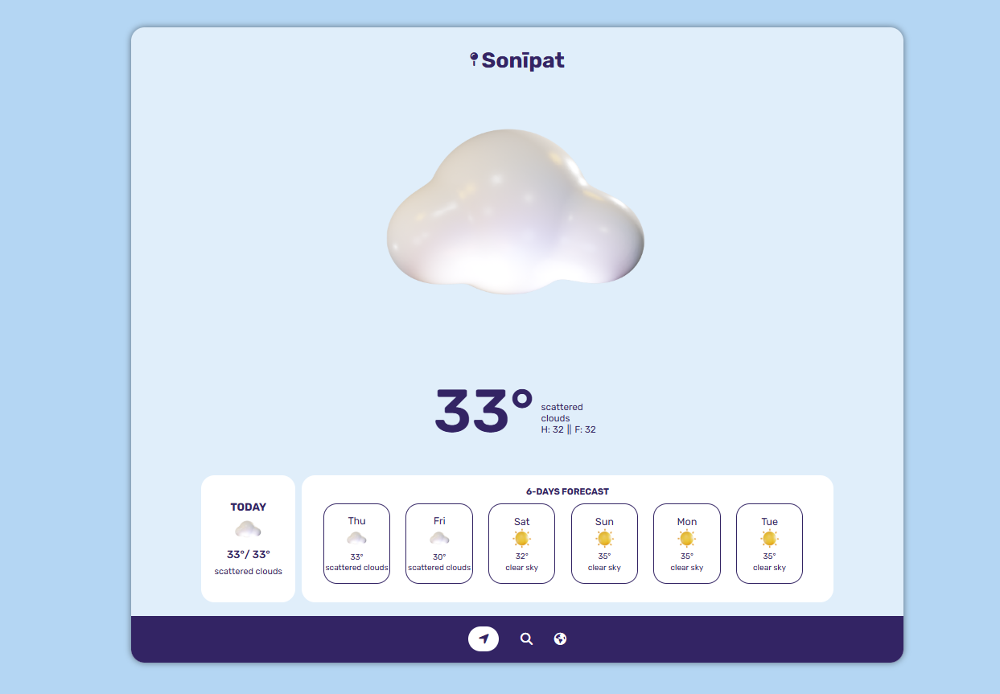

# 🌤️ Weather App

A beautifully designed and responsive Weather Application built using **HTML**, **CSS**, and **JavaScript**, powered by the **OpenWeatherMap API**. This app allows users to search for any city and view current weather conditions with rich UI and smooth user experience.

---

## 🔍 Features

- 🌆 Search weather by city name,
- 🌡️ Displays temperature, humidity, wind speed, and weather condition
- 🌤️ Weather icons based on condition
- 🎨 Modern and clean UI 
- ⚡ Real-time weather updates via OpenWeatherMap API
- 📱 Fully responsive and mobile-friendly

---

## 🖼️ Demo

## 📦 Technologies Used
HTML

CSS3

JavaScript (VanillaJS )

OpenWeatherMap API

## 💡 Future Improvements
🌓 Toggle between light and dark mode

🌐 Multi-language support

🤝 Contributing
Contributions,  issues and feature requests are welcome!
Feel free to fork the repo and submit a pull request.

🙋‍♂️ Author
Nikhil Mehlan  -nikhilmehlan1234@gmail.com

